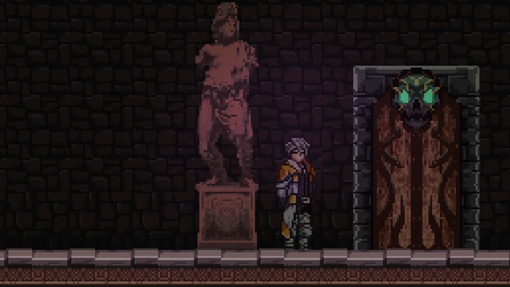

> Important Notes:
>
> Toolkit requires Unity 6.3 as a minimum version and has support for Unity 6.4 and 6.5 API already.

## SF Metroidvania Toolkit

This is a toolkit to help make Side Scrolling Metroidvanias easier to develop.
The toolkit has a range of features including, but not limited to:
1. Character controls
2. Custom physics using Unity's Low Level Physics 2D API for customization and better performance.
4. Ability System
5. Save/load System with optional encrypted files.
6. Item Database
7. Room Management

### Low Level Physics 2D API
The toolkit uses PhysicsShape and PhysicsBody. There is no Collider2D or Rigidbodoy2D components in any of the project.
If you have no used the Low Level Physics 2D API. Don't worry there are custom components in the toolkit that replaces the components.
The base class is called SFShapeComponent.

#### How to section
This goes over how to do commonly needed things and the basics. Later more advance examples will be done.
It will include stuff like the following:

- Character controller set up for physics.
- Room System set up for Metroidvania style room logic. 
- The different types of databases for rooms, items, and characters.
- How to create your own custom abilities for the player and non-controllable characters.

#### Project Physics Settings advice.
- Advice on how to use layers for really easy collision filtering.
- Physics2D set up for preventing ghost collisions in Unity 6 and newer.
  - This is mainly stuff like the contact threshold and iteration settings for velocity and position.
- How to debug physics issues using the Controller2D custom gizmos.

#### Release Notes
This will include release notes per package build used for stable releases.
